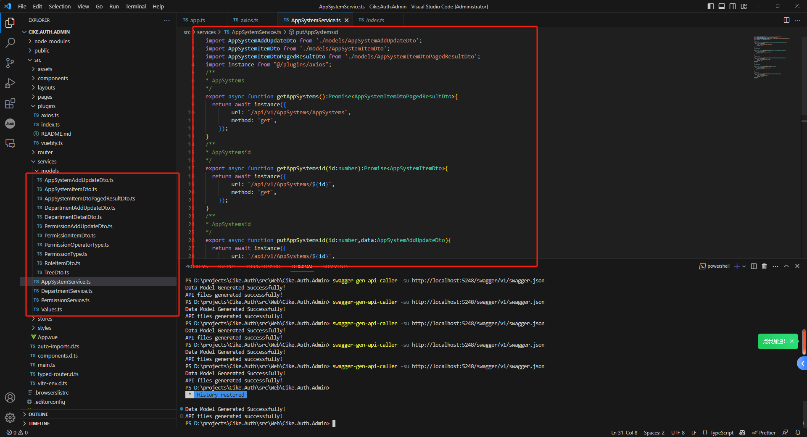

# SwaggerGenApiCaller
Generate front-end api call methods based on swagger documentation


# Remark
> Currently, this tool is only used to generate typescript backend api calls, and does not support the generation of other languages.


# Use
> At present, the tool is mainly used with Cike.Framekwork framework development front-end site, if you need to support other functions, please pull the code to modify

1. Installation tool
```powershell
npm install -g swagger-gen-api-caller
```

2. Generate api calls
```powershell
swagger-gen-api-caller -su http://localhost:5248/swagger/v1/swagger.json -o ./src/services
```

